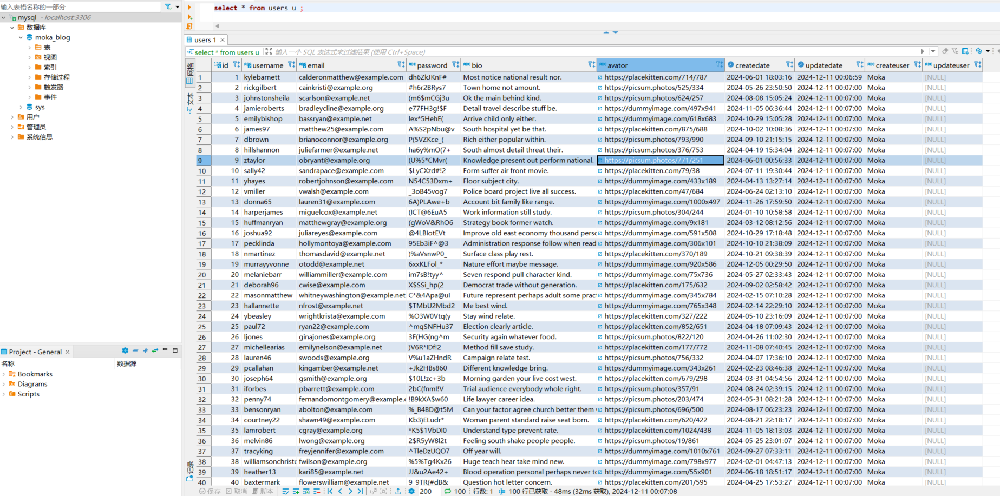

#### python 官网安装 python版本

提示：安装成功需要重新启动电脑, PATH环境变量才会生效

Python 3.13.1 

#### vs code 安装python 拓展

#### 安装 pymysql

```
C:\Users\FFT\AppData\Local\Programs\Python\Python313\Scripts>pip install pymysql
Collecting pymysql
  Downloading PyMySQL-1.1.1-py3-none-any.whl.metadata (4.4 kB)
Downloading PyMySQL-1.1.1-py3-none-any.whl (44 kB)
Installing collected packages: pymysql
Successfully installed pymysql-1.1.1

```

#### 执行py脚本自动生成表数据
[自动生成表数据脚本文件](./script/generate_data.py)
```
PS E:\Mysql_Notes> C:\Users\FFT\AppData\Local\Programs\Python\Python313\python.exe E:\Mysql_Notes\generate_data.py 
正在生成 100 条用户数据...
成功插入 100 条数据！
数据库连接已关闭。

```

如图：




